# Race-Condition Vulnerability Lab

**Member 5 — ISSD**

SEED Ubuntu 20.04 • Application-level TOCTOU • Completed experimental report

Setup evidence: 26 September 2026. Experiment and evidence-audit records: 3 October 2026.

## Executive summary

This work investigated a deliberately vulnerable, root-owned Set-UID application that checks `/tmp/XYZ` with `access()` and later opens the same name with `fopen()`. An ordinary user could replace the symbolic link between these operations. The privileged victim then appended a validated UID-0 account record to `/etc/passwd`.

The delayed demonstration and both genuine no-delay attack methods produced a complete account record and a successful **non-sudo `su - test` login followed by `id` reporting UID 0**. The naive attacker also suffered the documented sticky-directory failure: a root-owned regular file occupied its predictable pathname. Those failures were preserved alongside successes.

Two independent countermeasure trials left the target unchanged: **9,455 attempts over 300 seconds** against the least-privilege variant, and **9,177 attempts over 300 seconds** against the original victim with symlink protection enabled. Additional controls showed an allowed ordinary-file write and deterministic denied protected operations. These are finite observations supported by the privilege and pathname-resolution mechanisms, not empirical proof that all races are impossible.

The original password file was restored, root login shells and experiment processes were stopped, temporary paths were removed, and Set-UID was cleared from the victims. The final runtime protection policy was explicitly set to **symlinks=1, regular=2**. The saved 0/0 file does not establish the VM's original pre-lab runtime defaults.

<!-- pagebreak -->

## 1. Aim, scope and source

The objective was to demonstrate the effect of a time-of-check-to-time-of-use race on a protected account database and evaluate the official SEED countermeasures. The work covers Task 1, Tasks 2.A–2.C and Tasks 3.A–3.B of the SEED Race-Condition Vulnerability Lab [1]. It also addresses Member 5's allocation: explain the race before a live demonstration, show the vulnerable program, document commands and observations, explain attacker gain, and discuss secure handling, permissions, atomic operations and temporary files [2].

This is a **local application-level privilege-escalation lab**. Its prerequisite is the deliberately installed vulnerable Set-UID executable. The results do not demonstrate a remote attack, password cracking, Dirty COW, or a vulnerability in an otherwise unmodified Ubuntu installation.

## 2. Why this is a race

A race condition exists when the result of concurrent operations depends on their ordering. In a TOCTOU vulnerability, the object or property checked can change before the program uses it. Here the same pathname is resolved independently twice:

```text
Attacker (seed)                    Victim (real UID seed; effective UID root)
XYZ -> /dev/null
                                  access(XYZ, W_OK) passes
XYZ -> /etc/passwd
                                  fopen(XYZ, "a+") opens the new target
                                  append the input with effective root authority
```

`access()` checks using the real user identity. The later open uses the process's effective/filesystem credentials. A symlink changes name resolution; it does not itself grant root privileges. The vulnerable application's effective UID supplies the write authority that the ordinary user lacks [1, 3, 4].

The check does not bind the later open to the checked object. Protecting `/etc/passwd` with ordinary file permissions is therefore insufficient against this privileged confused deputy.

## 3. Environment and preparation

| Item | Recorded value |
|---|---|
| Guest | SEED Ubuntu 20.04.1 LTS, x86-64 |
| Kernel | 5.4.0-54-generic |
| Compiler | GCC 9.3.0; Ubuntu package 9.3.0-17ubuntu1~20.04 |
| Virtual machine | Eeshan4; attached SEED-Ubuntu20.04.vdi |
| Resources | 2048 MB configured RAM; one virtual CPU observed with `nproc` |
| Working directory | /home/seed/issd-member5/lab-files |
| Filesystem | ext4; observed mount options did not include nosuid |
| Ordinary caller | seed, UID 1000, GID 1000 |
| Password-file backup | /root/issd-member5-passwd.original |
| Saved settings | /home/seed/issd-member5/sysctl-before.txt, containing 0/0 |
| Original pre-lab runtime controls | Not established by the retained evidence |
| Attack-trial controls | protected_symlinks=0; protected_regular=0 |
| Final chosen runtime controls | protected_symlinks=1; protected_regular=2 |

The VirtualBox preset in S01 is labelled Oracle Linux (64-bit); the guest release output establishes Ubuntu. The host OS/version, host VirtualBox version and VM snapshot names were not established. The installed Guest Additions utility reported 6.1.10_Ubuntu, but a guest-property query did not return the host version; that utility version is not substituted for the host version.

The native guest filesystem was used rather than a shared-folder filesystem. The original password-file backup was reused without replacement. Baseline restoration and comparison were checked before independent trials. The clean SHA-256 was:

```text
b2386623b8c504aa933d9c519b96158bd55e5e6eb4ae75183d5abf9e5a191d67
```

Important documented setup operations were:

```bash
bash build.sh
sudo chown root:root vulp vulp_slow vulp_least
sudo chmod 4755 vulp vulp_slow vulp_least
sudo sysctl -w fs.protected_symlinks=0
sudo sysctl -w fs.protected_regular=0
ls -ld /tmp
ls -l vulp vulp_slow vulp_least attack_naive attack_atomic
```

The earlier build is visible in S03's original setup evidence. During the automated sessions, the existing C binaries were used rather than rebuilt; Set-UID was re-enabled for the follow-up and removed again during cleanup. The attackers were seed-owned ordinary executables. `/tmp` retained mode 1777. Reading the two sysctl nodes also required sudo in this VM because their observed permissions were 0600. Attackers, monitors and victim invocations were launched as seed, never through sudo.

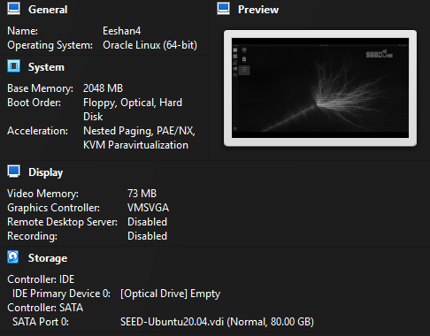

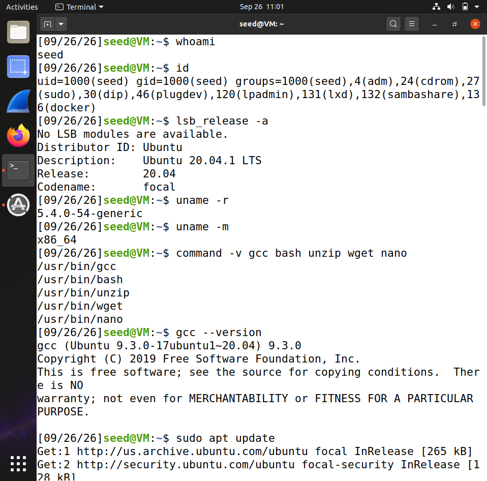

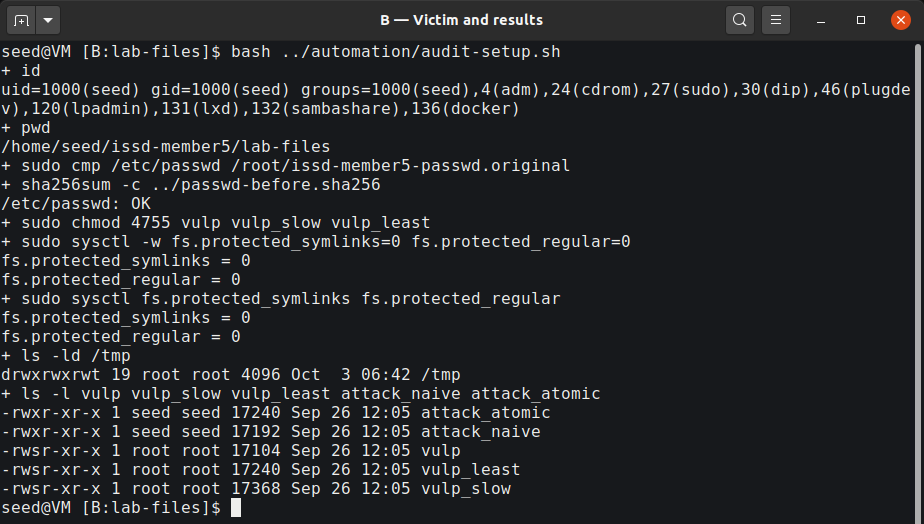

## 4. Program and instrumentation

The supplied educational adaptation retains the vulnerable sequence:

```c
if (access(fn, W_OK) != 0) {
    puts("No permission");
    return 1;
}
fp = fopen(fn, "a+");
```

Here `fn` is `/tmp/XYZ`. Mode `a+` requests append/read access and can create a file when the pathname is absent. That creation behaviour explains the naive attacker's failure. The adaptation checks input and I/O errors and reads at most 50 non-whitespace characters.

| Program | Purpose |
|---|---|
| vulp | Original vulnerable path, DEMO_DELAY=0 |
| vulp_slow | Same source, compiled with DEMO_DELAY=10 for Task 2.A |
| vulp_least | Same source, compiled with LEAST_PRIVILEGE |
| attack_naive | Separate unlink/symlink operations |
| attack_atomic | Initialized links exchanged with RENAME_EXCHANGE |

The C sources and executable contents were not changed during the automated experiments. The no-delay binary's imports included `access` and `fopen`, with no imported `sleep` or `seteuid`. Source defaults and the build commands support its identification as the no-delay victim; the separate slow binary was used only for Task 2.A.

The working `run_trials.sh` was changed to reject reused labels and retain attempts/elapsed seconds on interruption, including completion of an in-flight invocation. The original helper and its diff are retained. `lab_runner.py` checked seed identity, initialization and the clean baseline, coordinated bounded processes, and recorded actual stdout/stderr. It stopped the monitor when an attacker died and stopped the attacker after the monitor ended. These changes did not insert a delay between the victim's check and open.

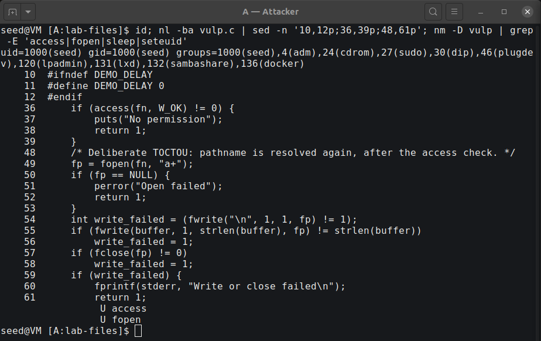

## 5. Task 1 — validate the target record

The selected input was exactly 43 characters:

```text
test:U6aMy0wojraho:0:0:test:/root:/bin/bash
```

Its seven fields are username, inline password hash, UID, GID, comment, home and shell. UID 0 grants the privilege; the name `test` does not. The legacy hash is the official lab's empty-password example and fits the victim's input limit. Its acceptance was tested on this VM rather than assumed for other systems. `/etc/shadow` was not modified.

The retained Task 1 image shows these administrator-assisted preparation operations and subsequent non-sudo login attempts:

```bash
test -w /etc/passwd || echo 'seed cannot write /etc/passwd'
sudo sh -c 'printf "\n" >> /etc/passwd'
sudo tee -a /etc/passwd < input.txt > /dev/null
su - test
id
whoami
```

One visible authentication attempt failed, and a later attempt succeeded with `uid=0(root) gid=0(root) groups=0(root)` and `whoami` returning root. The cause of that first authentication failure was not established. Subsequent interactive empty-password logins succeeded during the verified experiments. No fallback hash was needed.

**This task is manual account validation, not race-exploit success.** The injected account was removed by restoring the original baseline before independent attack trials.

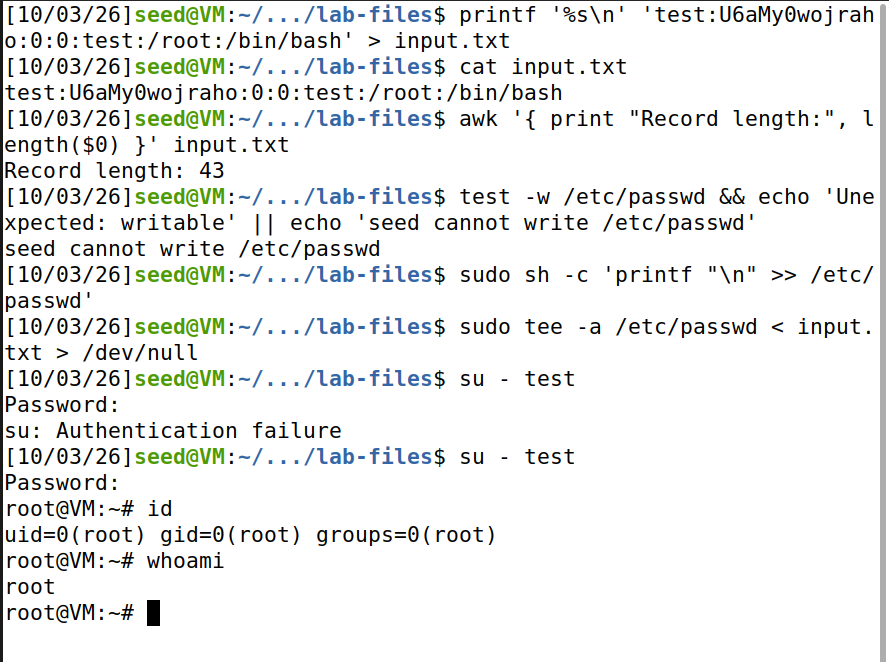

## 6. Task 2.A — make the timing visible

The slow build introduced the official artificial 10-second interval after the check. In A, seed created `XYZ -> /dev/null`. In B, `./vulp_slow < input.txt` printed `Check passed; RUID=1000 EUID=0; waiting 10 seconds...`. While it was waiting, A replaced the link with `XYZ -> /etc/passwd`.

```bash
# A, before the victim:
ln -s /dev/null /tmp/XYZ
# B:
./vulp_slow < input.txt
# A, after Check passed and within the 10-second interval:
ln -sfn /etc/passwd /tmp/XYZ
ls -l /tmp/XYZ
```

After return, the complete record was present. A non-sudo `su - test`, followed by `id` and `whoami`, verified UID 0. The follow-up for clearer S06/S07 used one slow invocation. The configured delay was 10 seconds; a separate total wall time was not measured for that manual-window run.

The observed link targets explain the result: the real-user check saw writable `/dev/null`, but the root-effective open later saw `/etc/passwd`. The follow-up used automated desktop commands for this same manual-window method; the authentication input remained interactive. This simulation explains the timing and is not represented as the genuine no-delay experiment.

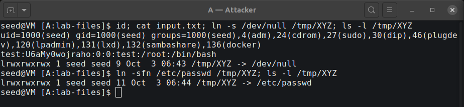

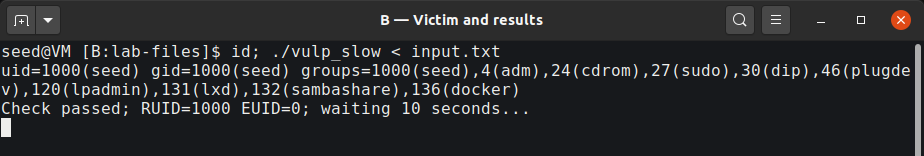

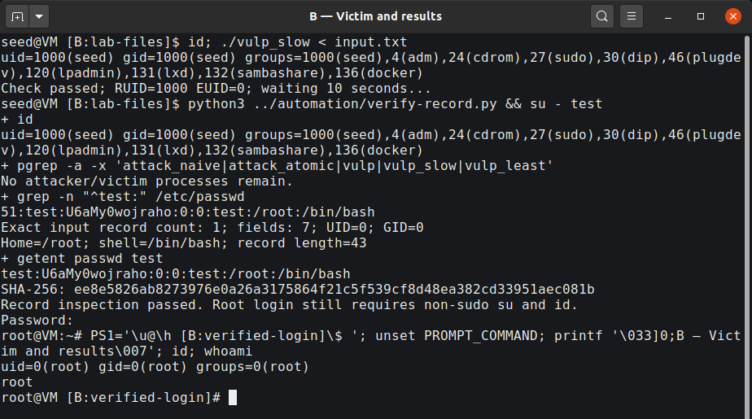

## 7. Task 2.B — genuine no-delay exploitation

The naive attacker repeatedly removed and recreated `/tmp/XYZ`, alternating `/dev/null` and `/etc/passwd`. These operations are separate system calls:

```c
unlink("/tmp/XYZ");
symlink(target, "/tmp/XYZ");
```

The monitor repeatedly invoked the original `./vulp` with `input.txt` and compared `/etc/passwd` SHA-256 values. All new measured attack trials used a 300-second monitor limit; their attackers had a separate 330-second bound. A hash change triggered inspection rather than being declared root access. The exact record and a non-sudo login were checked separately.

The visible runner commands for the audited capture were:

```bash
# A; wait for Naive switching active:
python3 ../automation/lab_runner.py attack ./attack_naive 330 task2b-audit1-20261003-064223
# B; starts the existing run_trials.sh as seed:
python3 ../automation/lab_runner.py monitor ./vulp 300 task2b-audit1-20261003-064223
```

| Trial identifier | Attempts | Monitor seconds | Runner wall seconds | Actual result |
|---|---:|---:|---:|---|
| Original task2b-20261003-052529 | Final total unknown | Final time unknown | Not recorded | Last progress: 76,000 / 227 s; stalled-file state preserved |
| retry1-20261003-054443 | 9 | 0 | 0.532873 | File exists; interrupted; target unchanged |
| retry2-20261003-054443 | 20 | 1 | 0.865370 | Exact record and non-sudo UID-0 login |
| capture-20261003-054443 | 2 | 0 | 0.378590 | File exists; interrupted; target unchanged |
| audit1-20261003-064223 | 1 | 0 | 0.237911 | Recorded live views; exact record and non-sudo UID-0 login |

The last four identifiers have the prefix `task2b-` in `logs/`. Bash `SECONDS` is integer-valued, so 0 seconds is not zero execution time. Runner wall time is measured around the monitor process and includes startup/exit handling; it is not the size of the vulnerable instruction window. These are individual scheduling outcomes, not performance guarantees.

### 7.1 Preserved sticky-bit failure

Before any reset of the pre-existing run, no experiment or su process remained. `/tmp` was root-owned with mode 1777. XYZ was a **root-owned regular file, group seed, mode 0664**, size 3,381,664 bytes. Both old logs, original metadata and a hash-verified content copy were preserved. The old log ended at 76,000 attempts / 227 seconds without a completion line, so its final count and time remain unknown.

The original File-exists message was user-reported after its terminal had closed. A clearly labelled new diagnostic produced an actual unlink `Operation not permitted` error. A subsequent new trial also produced an actual symlink `File exists` error. They are distinct observations, not reconstructed output.

The mechanism is the attacker's own TOCTOU gap. After `unlink()` and before `symlink()`, the name is absent. A victim that already passed its check can create a regular file at `fopen(..., "a+")` with root ownership. Sticky `/tmp` then prevents seed from removing that entry. Group write permission on the file does not grant sticky-directory deletion permission. Repeated victim exit status 0 is compatible with appending to this ordinary XYZ file, not to `/etc/passwd`; successful I/O alone is therefore not an exploit proof.

Administrator-assisted resets occurred only after processes had stopped and failure evidence was saved. They restored the original password file and removed the lab paths. This assistance is part of lab reset, not an unprivileged attack operation.

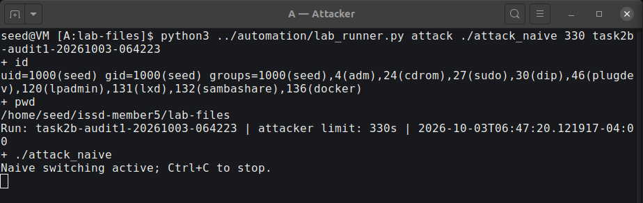

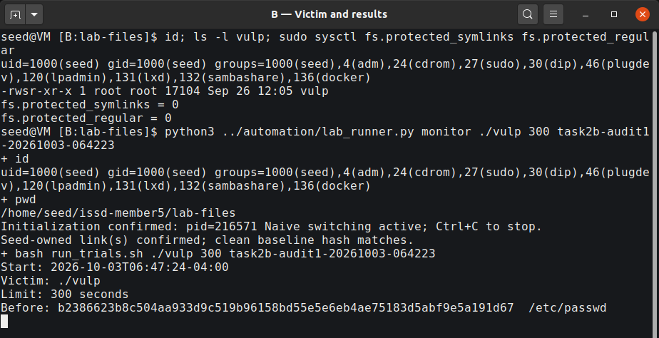

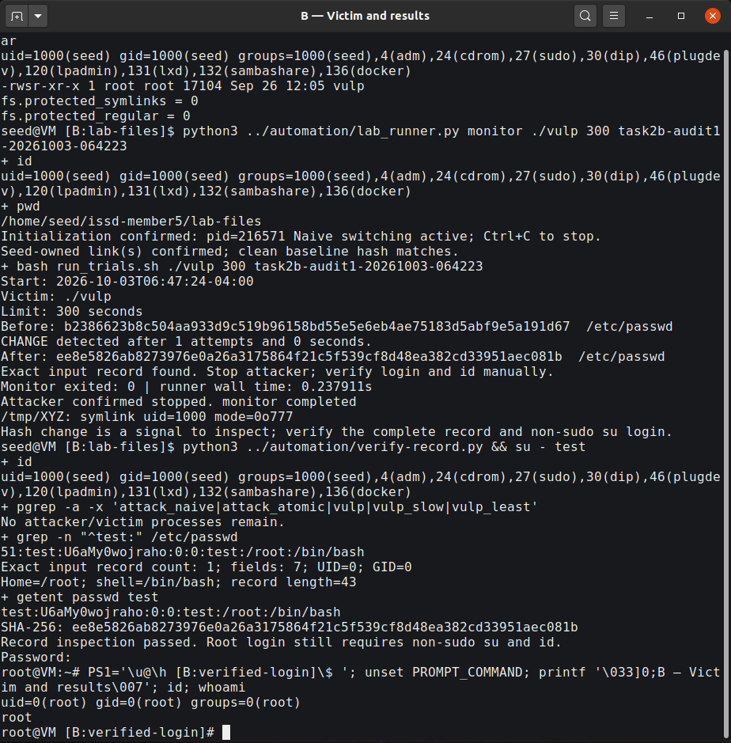

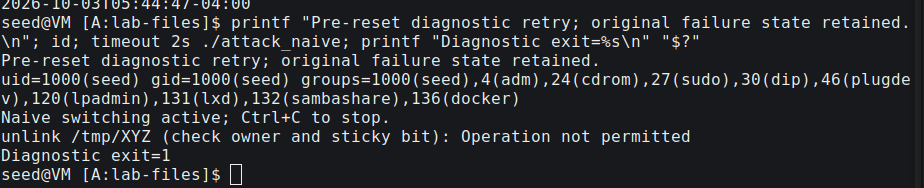

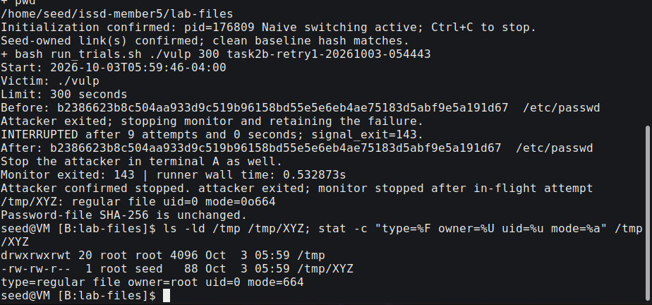

## 8. Task 2.C — atomic link exchange

The improved attacker initialized `XYZ -> /dev/null` and `ABC -> /etc/passwd`, printed its real initialization message, and repeatedly exchanged the directory entries:

```c
renameat2(AT_FDCWD, "/tmp/XYZ",
          AT_FDCWD, "/tmp/ABC", RENAME_EXCHANGE);
```

The monitor started only after initialization and seed ownership of the links were confirmed. This matters because initial link creation is still separate operations. Atomic switching avoids a missing XYZ name during exchange; it removes the naive attacker's creation gap. It does not combine the victim's `access()` and `fopen()` or make the victim safe [1, 5].

Run `task2c-20261003-054443`, using the no-delay `vulp` with controls 0/0, changed the target after **1 attempt**, with **0 integer monitor seconds** and **0.272765 runner wall seconds**. The exact record and non-sudo login produced UID 0. Both successful post-attack account files matched the clean baseline plus exactly one newline and the validated record; additional follow-up files passed the same comparison.

The improvement addresses a known reliability failure. Comparing one or a few trials does not establish that atomic exchange always wins immediately or has a universal speed advantage.

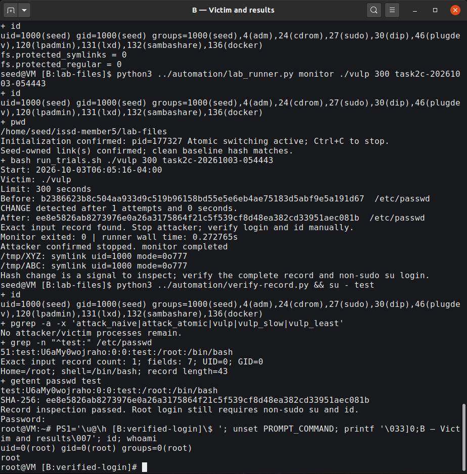

## 9. Task 3.A — least privilege

The fixed variant saved its privileged effective UID, then checked the return from `seteuid(getuid())` **before both check and open**. File writes and close remained unprivileged; the saved effective UID was restored only after file work. This illustrates the official temporary-drop exercise. A program with no remaining privileged purpose should avoid unnecessarily regaining privilege.

```c
if (seteuid(getuid()) == -1) {
    perror("seteuid: drop");
    return 1;
}
/* access(), fopen(), fwrite() and fclose() execute while privilege is dropped. */
```

The atomic attacker ran against `./vulp_least`, with both OS controls at 0. Run `task3a-20261003-054443` completed **9,455 invocations over 300 monitor seconds** (299.996265 runner wall seconds). The before/after password-file hash was identical and no test account appeared. The final recorded victim output was `Open failed: Permission denied`.

After the attacker stopped, two controls were executed:

```bash
ln -sfn /etc/passwd /tmp/XYZ
./vulp_least < input.txt
# Observed: No permission; exit 1
printf 'ordinary writable file\n' > ../allowed.txt
ln -sfn "$HOME/issd-member5/allowed.txt" /tmp/XYZ
printf 'normal-operation\n' | ./vulp_least
cat ../allowed.txt
```

The stable protected target failed at the real-user permission check. The permitted ordinary file received `normal-operation`; normal functionality was retained. In the race, a target switch cannot grant the dropped-privilege open root authority. The evidence supports **no success observed in 9,455 attempts over 300 seconds**, together with this privilege-boundary explanation.

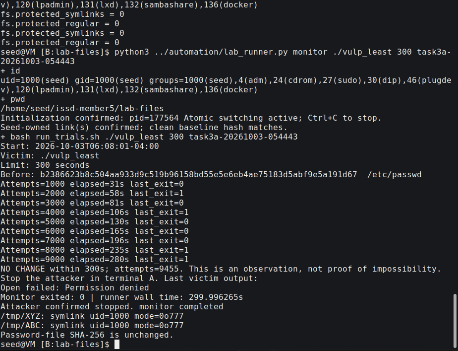

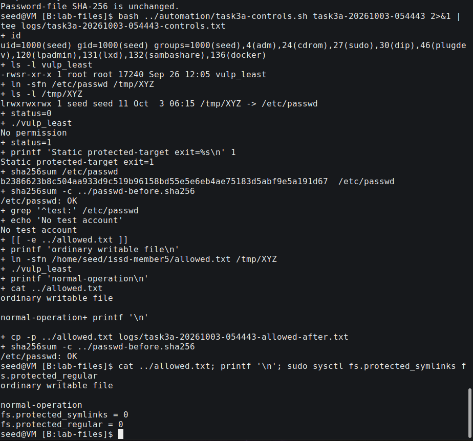

## 10. Task 3.B — operating-system symlink protection

The original vulnerable `./vulp` was used, not the least-privilege variant. `fs.protected_symlinks` was set to 1, while `fs.protected_regular` remained 0. Run `task3b-20261003-054443` completed **9,177 invocations over 300 monitor seconds** (299.564373 runner wall seconds). The target hash remained the baseline, no test account appeared, and the final victim output was `No permission`.

With the attacker stopped, a stable seed-owned link to writable `/dev/null` produced a more specific denied-open example:

```bash
ln -sfn /dev/null /tmp/XYZ
ls -ld /tmp /tmp/XYZ
./vulp < input.txt
# Observed: Open failed: Permission denied; exit 1
```

The real-user check can pass, but the root-effective open crosses the protected symlink boundary. Linux permits following such a link when at least one condition applies: it is outside a sticky world-writable directory; the follower's filesystem UID matches the link owner; or the link owner matches the directory owner [3]. Here `/tmp` and the privileged follower are root-owned/root-effective, while the link is seed-owned. None of those permission cases allows that privileged traversal.

This is defence in depth, not a general solution to mutable-path races. It depends on directory context and ownership and does not bind two independent lookups to one object. `fs.protected_regular` is a separate rule concerning certain `O_CREAT` opens of others' regular files in writable sticky directories; it is not a blanket ban on all root writes to `/tmp`.

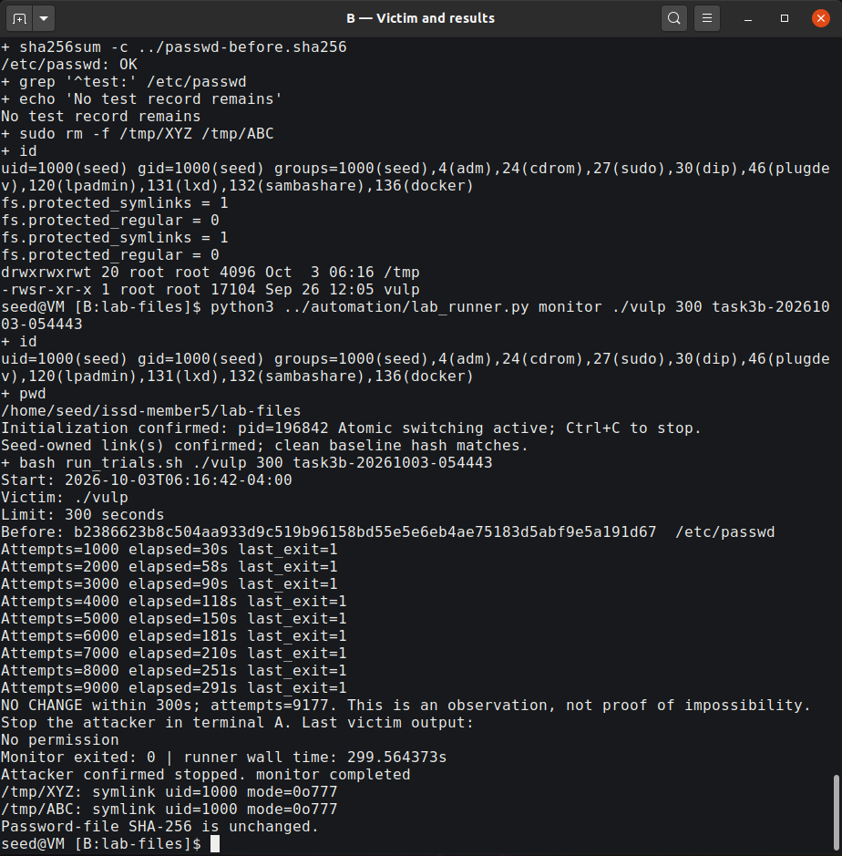

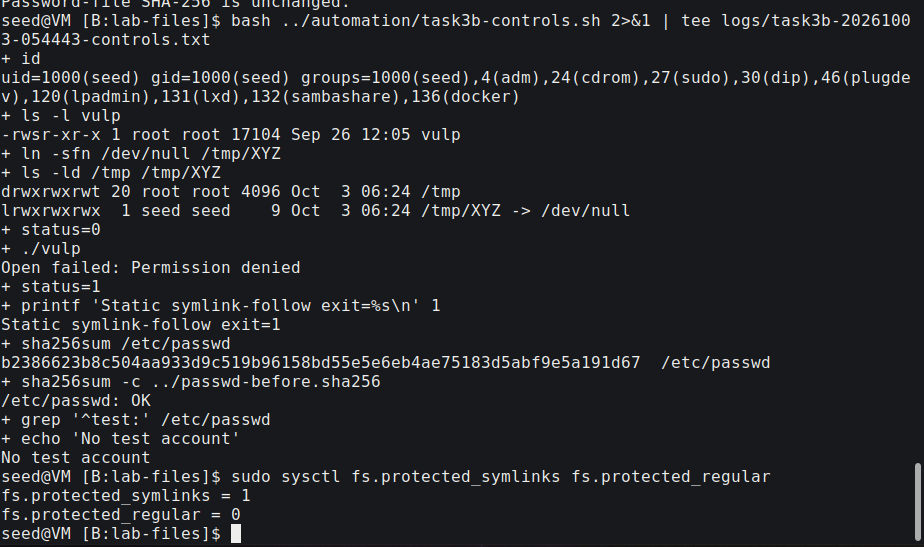

## 11. Findings, impact and secure design

| Task | Actual finding | Meaning |
|---|---|---|
| 1 | Manual insertion accepted; non-sudo login reached UID 0 after a retry | Target record is compatible with this VM |
| 2.A | Link switched during the explicit wait; exact record and UID 0 | The teaching window exposes check/use mismatch |
| 2.B | Genuine no-delay successes and preserved sticky failures | Timing can redirect the privileged write; naive switching has its own gap |
| 2.C | Initialized atomic exchange and genuine no-delay UID-0 success | Fixing the attacker's gap leaves the victim vulnerable |
| 3.A | 9,455 / 300 s, no target change; allowed write works | Dropped privilege prevents a root-authority open |
| 3.B | 9,177 / 300 s, no target change; stable privileged follow denied | Ownership/context-based symlink protection blocks this case |

The demonstrated gain was a successful local login with UID 0 through an account record appended by the privileged victim. Account-database integrity is a prerequisite for trusting authentication results: a local authorization error can undermine that database without breaking password cryptography. Automation helped coordinate the experiment; it is not a requirement of the vulnerability or an AI-specific attack.

Recommended design measures are:

* **Least privilege:** perform user-directed operations as the ordinary user; drop before the sensitive open and check errors.
* **Secure file handling:** open the intended object once, retain its descriptor and validate the opened object with suitable checks such as `fstat()`. Avoid checking a mutable name and then reopening it with greater authority.
* **Permissions and trusted directories:** restrict modification of security-sensitive directories and remove unnecessary Set-UID privileges. Target-file mode alone cannot constrain a privileged confused deputy.
* **Security-relevant atomic operations:** combine creation/existence handling, for example appropriate `O_CREAT | O_EXCL` use, rather than relying on an earlier pathname check.
* **Safe temporary files:** use `mkstemp()` or an appropriate private directory and keep the returned descriptor instead of replacing predictable shared-directory names.
* **Symlink-aware resolution and OS hardening:** apply suitable `O_NOFOLLOW`/directory-descriptor APIs where appropriate and retain OS protection. A final-component flag does not automatically secure every intermediate path component [6].

An advisory lock is insufficient when an attacker does not cooperate. Atomicity must protect the relevant security decision: Task 2.C's atomic operation improves the attack, not the vulnerable program.

## 12. Cleanup and final state

Before restoration, the monitor, attacker and any victim were stopped, root login shells were exited, and seed identity was checked. `cleanup.sh` restored `/etc/passwd` with `sudo cp -a /root/issd-member5-passwd.original /etc/passwd`, compared it with the original backup, and checked the recorded clean hash. No test record remained. `/tmp/XYZ` and `/tmp/ABC` were removed. All three victims ended root-owned with mode **0755**, with Set-UID removed.

Final protections were explicitly chosen as **symlinks=1, regular=2**, matching the installed policy file. These values are not claimed to be verified original runtime defaults. The saved 0/0 file and original password-file backup were retained. The VM is cleaned up; the live-demo guide explicitly re-enables the documented setup before a future classroom demonstration and cleans up afterward.

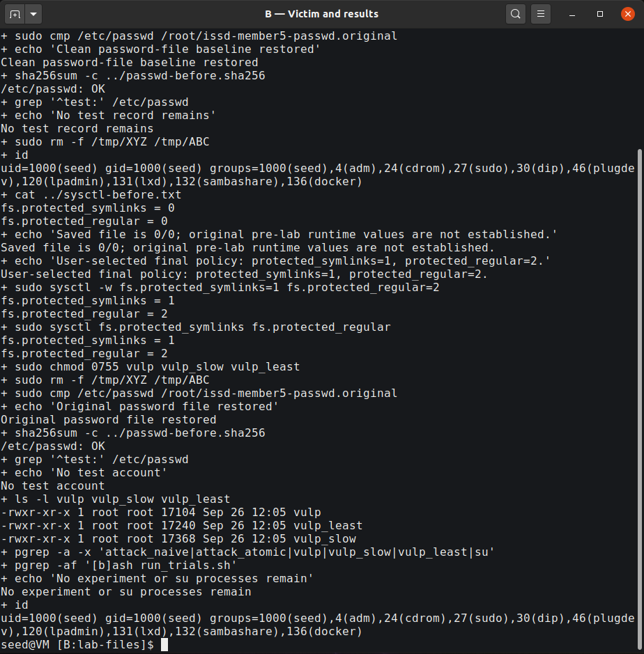

## 13. Evidence quality and limitations

The first terminal containing the original File-exists error was already closed when automation began. That message remains identified as user-reported; later actual errors were recorded separately. The original partial log's final totals were not inferred from its last progress line or from the size of XYZ.

Initial still captures missed the brief simultaneous-live interval. The follow-up used GStreamer's native X11 source to preserve a lossless sequence of whole-desktop PNGs before starting the monitor. It requested 30 FPS but actually produced **25 frames in 10.004403 seconds** on this VM. Frame 9's attacker/monitor PID-start identities were live at encoder-input and file-completion observations. Frame 10 displayed Start/Limit/Before; both were live at encoder input, but had ended by file completion. File-write time follows image capture and is not equated with a still-running process. Full metadata and original frames are retained.

Frame recording and monitoring affect scheduling. Trial counts and wall times apply to these executions, not to a general success probability or the duration of the vulnerable instruction interval. Finite unsuccessful defence trials are interpreted alongside code/credential reasoning and static controls.

Report and slide excerpts are **labelled readability crops of actual images**. The unaltered whole-desktop originals remain in `evidence/`; crop boxes, original hashes and derivative hashes are recorded in `figures/CROP_MANIFEST.json`. No output was manufactured or redrawn as terminal evidence. Earlier failures and the original exports remain preserved. Terminal screens were cleared for the later audit only at the user's request after preserving their prior records.

## 14. Conclusion

The target record was validated, the delayed and genuine no-delay attacks produced verified UID-0 logins, and the naive attacker's root-owned-file failure was observed and explained. Atomic exchange removed the attacker's missing-name interval while leaving the application's check/use error intact. Both independent defences prevented a target change in their recorded 300-second trials, with controls explaining the denied operations and retained permitted functionality.

The central lesson is: **checking an attacker-changeable name does not make a later privileged use of that name safe.** Privilege boundaries, descriptor-based handling and secure creation must protect the operation itself, with OS hardening as an additional layer.

## References and attribution

1. Wenliang Du / SEED Labs, *Race Condition Vulnerability Lab*, copyright 2006–2020. Official seven-page task PDF and original lab setup, consulted with the retained local copy on 3 October 2026. https://seedsecuritylabs.org/Labs_20.04/Files/Race_Condition/Race_Condition.pdf
2. Supplied lecturer authentication/lab-link text and *ISSD presentation division .pdf*, Member 5 allocation; preserved under `Member5/course-materials/`.
3. Linux kernel documentation, *Filesystem sysctls: protected_symlinks and protected_regular*. https://www.kernel.org/doc/html/latest/admin-guide/sysctl/fs.html
4. Linux manual pages, *access(2)* and *credentials(7)*. https://man7.org/linux/man-pages/man2/access.2.html and https://man7.org/linux/man-pages/man7/credentials.7.html
5. Linux manual pages, *rename(2)*, including `renameat2()` and `RENAME_EXCHANGE`. https://man7.org/linux/man-pages/man2/rename.2.html
6. Linux manual pages, *open(2)* and *mkstemp(3)*. https://man7.org/linux/man-pages/man2/open.2.html and https://man7.org/linux/man-pages/man3/mkstemp.3.html
7. SEED Labs, Ubuntu VM setup and Race-Condition lab page. https://seedsecuritylabs.org/labsetup.html and https://seedsecuritylabs.org/Labs_20.04/Software/Race_Condition/
8. Repository `Member5/START_TO_FINISH_GUIDE.md`, the supplied annotated C/shell adaptation, and the audited VM logs/images accompanying this submission.

SEED teaching content and the vulnerable-program pattern are attributed to **Wenliang Du / SEED Labs** under **Creative Commons Attribution-NonCommercial-ShareAlike 4.0 International**. That attribution and licence are retained with the source materials.

**Assistance disclosure:** an AI coding assistant through OpenCode helped orchestrate visible desktop commands, preserve logs and failures, inspect evidence, and prepare the report/slides. Authentication input was handled interactively by the user. The lab C sources and binary contents were not rewritten during those automated runs; monitor changes and helper code are supplied. This report does not claim that an oral classroom presentation has already been rehearsed or delivered.

## Appendix A — deliverables and provenance

The submission contains the completed editable report/PDF, main findings presentation/PDF, terminal-specific live-demo guide, speaker notes, selected original images, labelled crop derivatives, the C/shell sources, and relevant trial/control logs. `README.md` identifies the entry points. `evidence/SELECTION.json` identifies the original source and hash of each selected image. `logs/` retains distinct labels, including failed trials, and `provenance/` records the audit and verified logins.

The complete original evidence archive remains in `/home/seed/issd-member5/exports/member5-evidence-audited-20261003-064223.tar.gz` with its checksum. It includes raw transcripts, frame sequence and preservation records beyond the selected submission figures. The preserved original VM account-file backup stays at its recorded root-owned location.

## Appendix B — classroom demonstration

Use `LIVE_DEMO.md`/`LIVE_DEMO.pdf` for the exact order of commands in **A — Attacker** and **B — Victim and results**. The main PPTX introduces the race, switches to the reliable 10-second teaching demonstration, then supports a bounded genuine no-delay atomic run and a deterministic OS-defence check. Its findings tables are explicitly recorded results from 3 October 2026, not predetermined live output.

A 30-second classroom no-delay timeout is reported as that live attempt's outcome; it is not the original 300-second experiment. If timing misses, use the supplied actual S09/S11 evidence and say that it is recorded. After a demonstration, exit root, stop experiment processes and run the supplied cleanup. No actual spoken rehearsal duration is claimed.
