# Dirty COW Attack Lab

**Member 6 — ISSD**

SEED Ubuntu 12.04 • CVE-2016-5195 • Completed experimental report

Fresh experiments and evidence: **9 October 2026**

## Executive summary

The two official SEED Dirty COW tasks were completed in the prescribed isolated, 32-bit Ubuntu 12.04 VM. An ordinary seed process first modified a root-owned dummy file, then changed the UID field of the lab account charlie. Both changes were checked against complete before/after files, fresh backing-file reads, hashes and restrictive ownership/mode.

The normal-COW control changed private memory while leaving the backing file unchanged. In contrast, the vulnerable-kernel race produced the exact dummy result `111111******333333\n`. The account trial replaced charlie's four-character UID field `1001` with `0000`, preserving every other byte. A fresh **non-sudo `su - charlie`** subsequently gave **numeric UID 0**. Its first authentication attempt failed; the successful retry and the failure are both retained.

Each task used one bounded 30-second trial and recorded **0 integer elapsed seconds**. This is the supplied wrapper's timing resolution, not zero execution time or a measured kernel race-attempt count. The UID-0 shell was exited, the complete normal account baseline was restored, and a new charlie login returned **UID 1001 / GID 1002**. The dummy and experiment processes were removed, evidence was exported and verified, and the VM was shut down normally.

The optional patched-VM comparison was **not performed; discussion only**. Kernel patching, system updates, limiting local access and monitoring privilege escalation are discussed as required by the group allocation.

<!-- pagebreak -->

## 1. Aim and scope

The aim was to reproduce and explain the historical Linux Dirty COW vulnerability, CVE-2016-5195, in the required SEED environment [1–3]. The official practical consists of Task 1, modifying a dummy read-only file, and Task 2, modifying a password-file UID to obtain root privilege. Member 6's allocation additionally requires the COW explanation, important commands, environment/attack/result screenshots, four countermeasure themes and a short live demonstration [4].

All experiment operations on `/zzz`, `/etc/passwd` and charlie took place inside **ISSD-Member6-SEED12**, UUID `242db196-83e1-4b7a-9f0b-e399d6f8b9dc`. The programs ran as ordinary seed on native guest ext4 storage. Arch-host tools delivered visible commands, captured the actual guest framebuffer and checked exported evidence. Administrator privileges were used to prepare and restore the lab state; both attacks ran with real/effective UID 1000.

## 2. Background and security model

### 2.1 Normal copy-on-write

Copy-on-write allows memory pages to be shared until modification requires a private copy. With a private file mapping, a process's private modifications must not update the backing file. `MAP_PRIVATE` specifies this isolation; it does not grant ordinary file-write permission [5].

```text
File-backed page -> private mapping -> private write
                                      |
                                      v
                              private copy changes
                              backing file unchanged
```

The control opens `/zzz` with `O_RDONLY`, maps it using `PROT_READ | PROT_WRITE` and `MAP_PRIVATE`, and uses `memcpy()` on the private mapping. A fresh `pread()` and a separate terminal read check the underlying file. This is a deliberately writable private mapping, unlike the attack's read-only mapping.

### 2.2 The Dirty COW race

The attack opens the protected target read-only and privately maps it with `PROT_READ`. One worker repeatedly writes through `/proc/self/mem`, an interface to its own address space. The other repeatedly calls `madvise(..., MADV_DONTNEED)`, discarding relevant mapping/page state so subsequent access can refault or repopulate it [5–7].

```text
Writer worker                       Discard worker
pwrite(/proc/self/mem, ...)          MADV_DONTNEED
       \                            /
        concurrent kernel COW/page handling
                       |
            vulnerable interleaving
                       v
          backing-file bytes can change
```

In affected kernels, this interaction can mishandle COW/write-protection state and allow modification of the file-backed page despite the caller lacking file-write permission. Neither `MAP_PRIVATE` nor `madvise()` alone causes the bypass. A direct assignment through the read-only pointer is not the exploit method. The diagram is a high-level mechanism explanation; no kernel instruction trace or exact winning interleaving was measured here.

Dirty COW is a **local kernel privilege-escalation vulnerability**. Member 5's application-level race instead swaps a symlink between a deliberately privileged program's check and use. This lab requires no installed root-owned Set-UID victim. The supplied attack and control binaries remained ordinary seed-owned 0755 executables.

## 3. Environment and research-based choice

The official lab is hosted under a `Labs_20.04` URL, but specifies the historical **SEED Ubuntu 12.04 VM**. The historical VM manual identifies its 32-bit environment and kernel 3.5.0-37-generic [1, 3]. The previously downloaded official image and existing VirtualBox installation were reused. The fresh run rechecked the actual guest rather than treating the VM profile or old captures as runtime evidence.

| Item | Actual recorded value |
|---|---|
| Host | Arch Linux x86-64; kernel 7.2.9-arch1-1 |
| VirtualBox | 7.2.20r175154; installed module matched the host kernel |
| Guest VM | ISSD-Member6-SEED12; separate SEED12 disk |
| Image | SEEDUbuntu12.04.zip; official-linked download verified during preparation |
| Guest release | Ubuntu 12.04.2 LTS, precise |
| Architecture | i686; `getconf LONG_BIT` returned 32 |
| Running kernel | 3.5.0-37-generic |
| Kernel package | 3.5.0-37.58~precise1; i386; source linux-lts-quantal |
| Resources | 2048 MB configured RAM; two virtual CPUs |
| Compiler | GCC 4.6.3, Ubuntu/Linaro 4.6.3-1ubuntu5 |
| Ordinary caller | seed, UID 1000, GID 1000 |
| Workspace | /home/seed/issd-member6/lab-files; native ext4 |
| Transfer | M6pack read-only input; M6export writable export, mounts verified |
| Network | Virtual network cable disconnected throughout the fresh experiments |
| Clean snapshot | M6-clean-SEED12; pre-execution |
| Prepared snapshot | M6-charlie-normal-ready; powered-off normal account/dummy state |

The image's published MD5 was checked during preparation to detect transfer corruption; a SHA-256 and ZIP CRC checks were also retained. Runtime vulnerability assessment uses the actual kernel/package family and vendor information [8]. The Ubuntu fixed version 3.2.0-115.157 belongs to a different kernel stream and is not a universal numeric threshold for this `linux-lts-quantal` package. The observed protected-file changes establish this particular guest's vulnerable behaviour.

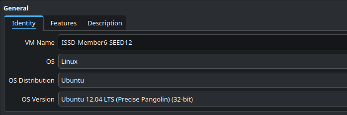

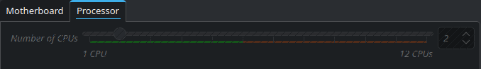

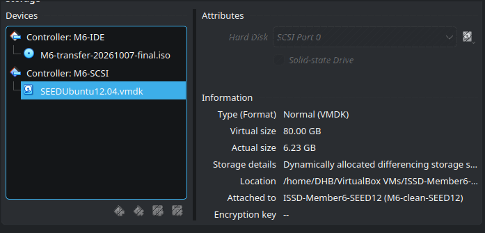

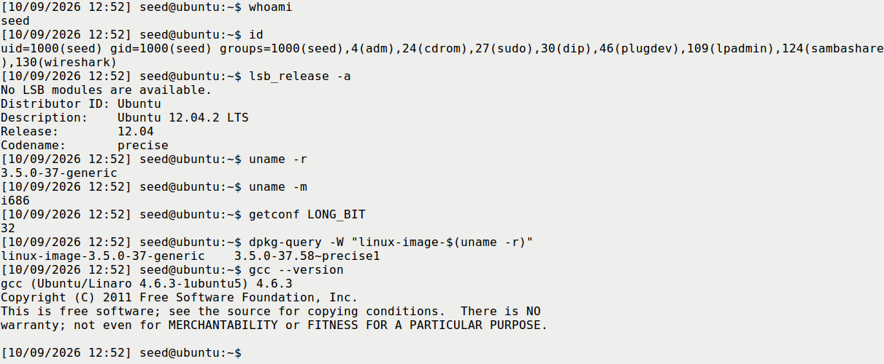

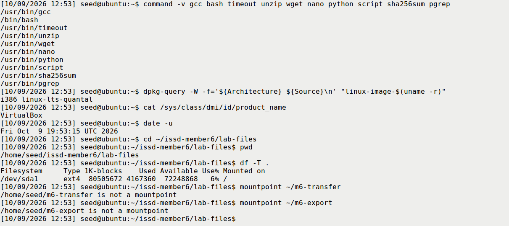

## 4. Code and build

The four supplied files, `cow_attack.c`, `cow_control.c`, `build.sh` and `run_trial.sh`, were preserved byte-for-byte. Host and guest hashes matched `SOURCE_SHA256SUMS`; source content retained LF line endings. A fresh `bash build.sh` returned 0 and produced ordinary seed-owned ELF32 executables, 12,540 bytes for the attack and 7,601 bytes for the control.

The build used the supplied commands:

```bash
gcc -std=gnu99 -Wall -Wextra -O2 -pthread cow_attack.c -o cow_attack
gcc -std=gnu99 -Wall -Wextra -O2 cow_control.c -o cow_control
```

| Source location | Meaning |
|---|---|
| cow_attack.c:31–61 | Two concurrent discard/write workers; checked madvise and process-memory writes |
| cow_attack.c:73–98 | Rejects root execution; fixed dummy/passwd modes; validates actual nonzero UID |
| cow_attack.c:100–114 | Opens target read-only; checks target; privately maps it with PROT_READ |
| cow_attack.c:116–131 | Bounded unique-pattern search and correct-width virtual-address conversion |
| cow_attack.c:139–150 | Creates and joins both workers |
| cow_control.c:24–42 | Writable private mapping, memcpy, complete fresh backing-file read |
| run_trial.sh | Reads actual UID, saves full copies, limits runtime and stops on detected change |

The repository adaptation uses `pwrite()` instead of the upstream separate `lseek()`/`write()` pair. Its offset is a **virtual address in the attacker's process**, not an ordinary byte offset used to open the protected file for writing. `_FILE_OFFSET_BITS=64` and conversion through `uintptr_t` avoid signed truncation of a 32-bit pointer. The reported `file-byte-offset` separately identifies the intended target location.

Fixed task modes, bounded `memmem()` searching, unique account-prefix matching, same-width UID replacement and checked setup calls make the educational example easier to inspect. The workers still repeat a timing-dependent kernel race. The shell wrapper polls the file hash, normally sleeping 0.2 seconds between observations; its timer counts integer wall seconds, not worker iterations.

Supplemental helpers verified the exact VM/workspace, whole files, metadata, process exit and cleanup. The host capture helper gained a fresh-output-directory option and exact VM UUID validation. Detailed verification was redirected to logs. These changes did not modify the supplied four C/build/trial files or manufacture terminal output.

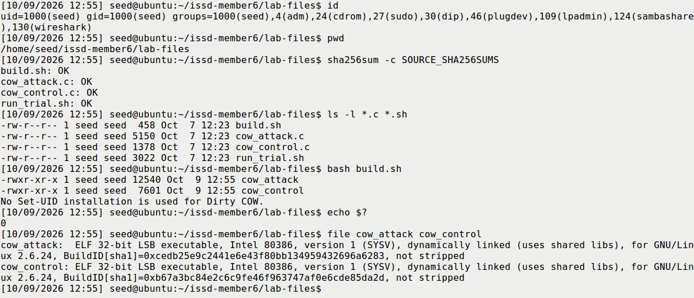

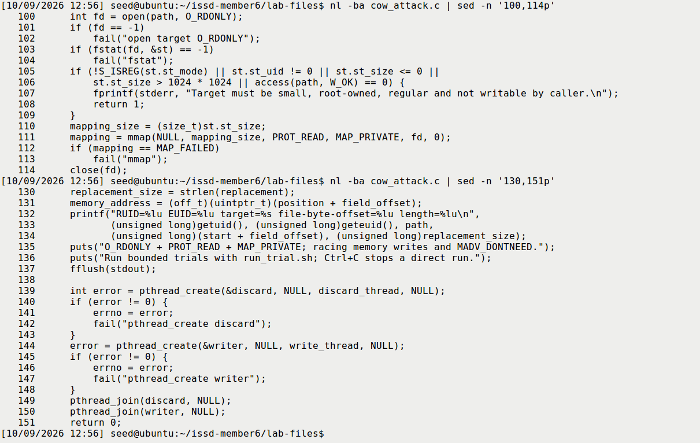

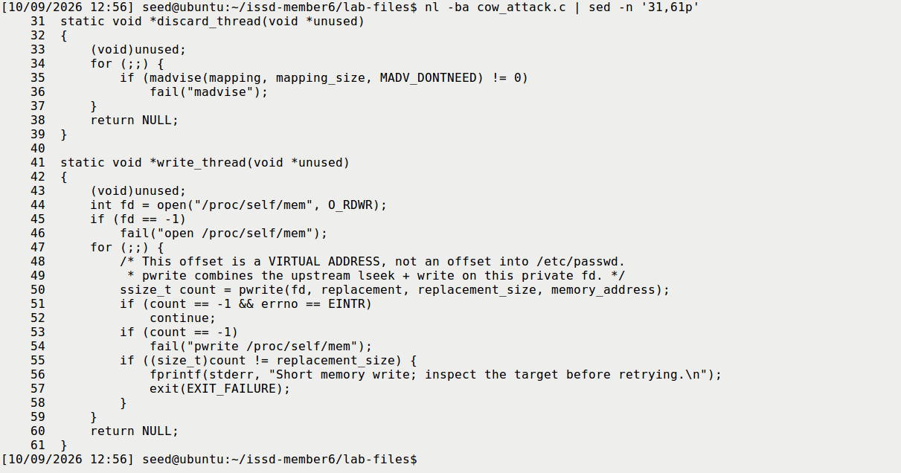

## 5. Task 1 — dummy file

### 5.1 Starting permissions and denied normal write

The initial inspection established that `/zzz` was absent. It was created administratively with exactly `111111222222333333\n`, root:root ownership and mode 0644. The 19-byte file was readable but not writable by ordinary seed. A normal shell redirection was then attempted as seed:

```bash
echo 99999 > /zzz
cat /zzz
sha256sum /zzz
```

**EXPECTED:** ordinary writing fails and the original remains. **ACTUAL:** Bash reported `Permission denied`, exit 1; the fresh content and hash were unchanged. **EXPLANATION:** ordinary permission enforcement works for this direct file-write path. Here “read-only” is relative to seed, not a read-only-mounted filesystem.

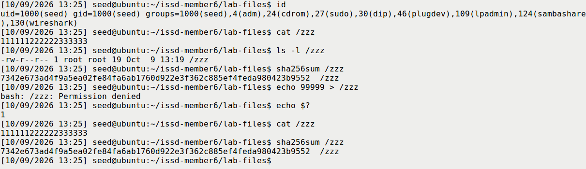

### 5.2 Normal copy-on-write control

The supplied `./cow_control` was run as seed and its output retained in `logs/fresh-control-01.txt`. It reported:

```text
Private memory: 111111******333333
Backing file:   111111222222333333
```

**EXPECTED:** private memory changes while the backing file does not. **ACTUAL:** a new `cat /zzz` returned the original, the saved-hash check passed, and complete baseline `cmp` returned 0. **EXPLANATION:** the writable private mapping and direct `memcpy()` correctly affected only a private copy. This control differs from the exploit's read-only mapping and `/proc/self/mem` path; it is not simply the same exploit with one thread removed.

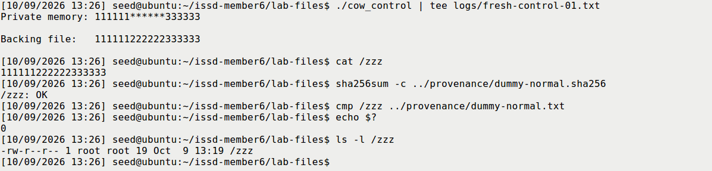

### 5.3 Bounded race and exact backing-file result

The visible invocation was:

```bash
id
bash run_trial.sh dummy 30 fresh-t1-01
```

| Measurement | Actual value |
|---|---|
| Start | 2026-10-09 13:28:48 -0700, or 20:28:48 UTC |
| Trial count | One; no Task 1 attack retry |
| Runtime limit / integer elapsed | 30 seconds / 0 seconds |
| Program identity | RUID 1000, EUID 1000 |
| Intended field | Byte offset 6; replacement width 6 |
| Full result | 111111******333333 followed by newline |
| Owner/mode/length | root:root, 0644, 19 bytes before and after |
| Program errors | None in the retained three-line program output |

**EXPECTED:** exact replacement can occur on the prescribed vulnerable kernel. **ACTUAL:** the complete backing file became the expected 19-byte sequence. **EXPLANATION:** the ordinary memory-management race changed data that the direct file write could not change. A fresh complete expected-byte comparison returned 0, and live and independent exported-file verifiers accepted the same copies, metadata and program identity.

```text
Before SHA-256:
7342e673ad4f9a5ea02fe84fa6ab1760d922e3f362c885ef4feda980423b9552
After/live SHA-256:
97c0ed6bb0deb556349015713d1c0a86d11e1bf5572a78b087650e814479b47b
```

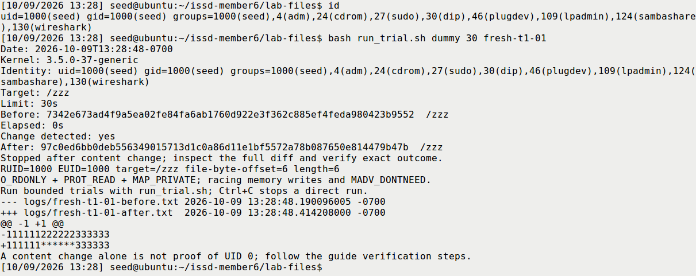

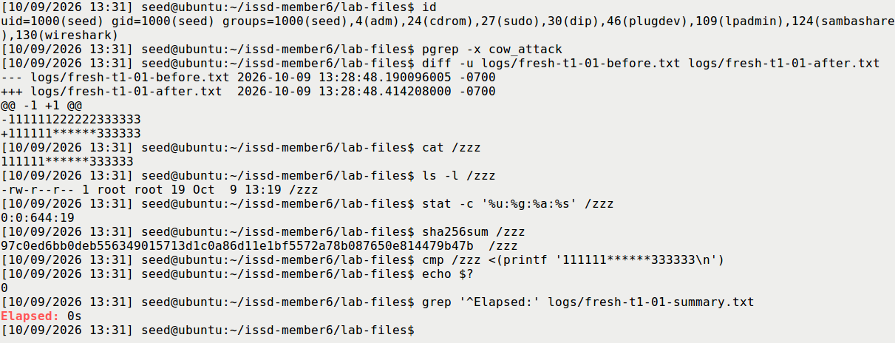

### 5.4 Interpretation and reset

The evidence chain is direct write denied → normal private copy leaves the file intact → ordinary race changes the actual backing file. A changed hash alone could indicate an unintended or partial modification, so the full file was compared. The displayed file modification time still showed the setup minute, illustrating why timestamps alone are inadequate integrity evidence.

No fine-grained attack runtime or kernel-level attempt count was measured. A `0s` integer reading does not mean instantaneous execution, and one successful trial does not establish a general success probability. After the attacker stopped and evidence was exported, an administrative reset restored the exact original dummy before the prepared snapshot. That reset is not counted as attack evidence.

## 6. Task 2 — account UID modification

### 6.1 Normal account and protected baseline

After another absent-account check, `adduser charlie` created the lab account. Password entry and optional-field prompts were handled interactively. The actual seven-field record was:

```text
charlie:x:1001:1002:,,,:/home/charlie:/bin/bash
```

The fields are username, password reference, UID, GID, comment, home and shell. `x` refers to the existing shadow entry; no password hash was overwritten by the attack. UID and GID were measured independently: they were **1001 and 1002**, not an assumed identical pair.

A fresh non-sudo login returned UID 1001, GID 1002 and `whoami` charlie, then exited to seed. Only afterward was `/root/issd-member6-passwd.normal` created without overwriting a previous backup. Its complete bytes were compared to `/etc/passwd`; the original hash, charlie record and numeric UID-0 list were separately saved. Only `root:0` was present in that original list.

**EXPECTED:** a working ordinary login and restorable post-creation account state. **ACTUAL:** both passed. **EXPLANATION:** this establishes a usable password and a baseline that includes the normal charlie account. A pre-adduser file would not be the same restoration target.

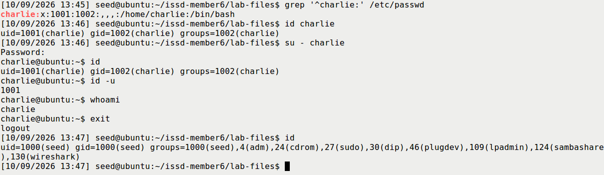

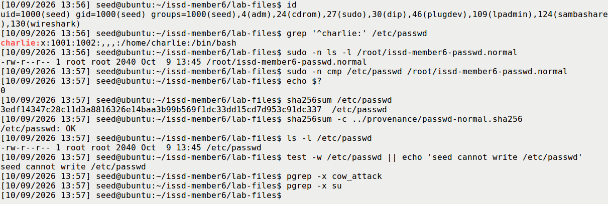

The first transcript was closed/exported and the dummy reset before the VM was shut down normally. `M6-charlie-normal-ready`, UUID `0d3457ab-f5ce-4606-8bee-1842809ca831`, was then taken powered off. After boot, source hashes, normal file hash, protected-backup comparison, identity and stopped-process checks passed again before Task 2.

### 6.2 Exact same-width UID overwrite

The ordinary-seed invocation was:

```bash
id
grep '^charlie:' /etc/passwd
bash run_trial.sh passwd 30 fresh-t2-01
```

The wrapper read charlie's actual UID and passed it to the supplied C program. That program uniquely matched the exact account prefix and wrote the same number of zero characters into the UID field. The complete-file comparison established:

```text
-charlie:x:1001:1002:,,,:/home/charlie:/bin/bash
+charlie:x:0000:1002:,,,:/home/charlie:/bin/bash
```

| Measurement | Actual value |
|---|---|
| Start | 2026-10-09 14:17:08 -0700, or 21:17:08 UTC |
| Trial count | One; no Task 2 exploit retry |
| Limit / integer elapsed | 30 seconds / 0 seconds |
| Program identity | RUID 1000, EUID 1000 |
| UID-field offset / width | Byte offset 2002 / four characters |
| File owner/mode/length | root:root, 0644, 2040 bytes before and after |
| Other file differences | None; live and exported whole-file comparisons agree |

**EXPECTED:** only the UID field is replaced with same-width zeroes. **ACTUAL:** exact `1001` → `0000`, with all other bytes identical. **EXPLANATION:** fixed-width replacement preserves separators, GID and the rest of the account database. Two original positions already contained zero; the operation replaces a four-character field, not four necessarily different bytes. A single-character overwrite would have left unwanted original digits.

```text
Normal/restored SHA-256:
3edf14347c28c11d3a8816326e14baa3b99b569f1dc33dd15cd7d953c91dc337
After/live SHA-256:
99fced9d0853d999474f92617022e78efe7c87b0f63450da264c46bfa9d47cd2
```

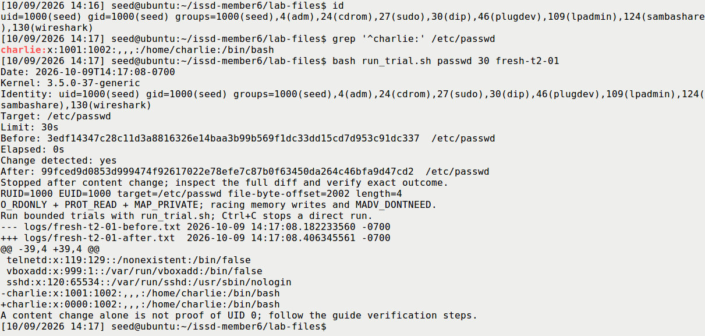

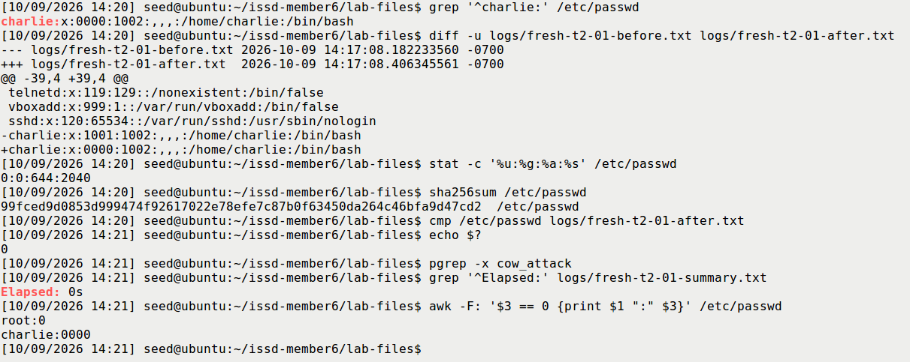

### 6.3 Fresh non-sudo privilege proof

A new `su - charlie` was attempted from seed after the attacker stopped. The first attempt returned `su: Authentication failure`. Its cause was not established. A second non-sudo attempt accepted interactive authentication and opened a child shell. Actual commands in that session returned:

```text
id
uid=0(root) gid=1002(charlie) groups=0(root),1002(charlie)
id -u
0
whoami
root
```

**EXPECTED:** a successful fresh login applies numeric UID 0. **ACTUAL:** UID 0 was observed, with proof-shell PID **3392**. **EXPLANATION:** UID 0 supplies root authority regardless of the login account name. `whoami` resolved it to root; primary GID remained charlie's 1002. The existing seed shell had stayed UID 1000. The successful authentication was not a `sudo su`, and no new exploit trial occurred between the failed and successful authentication attempts.

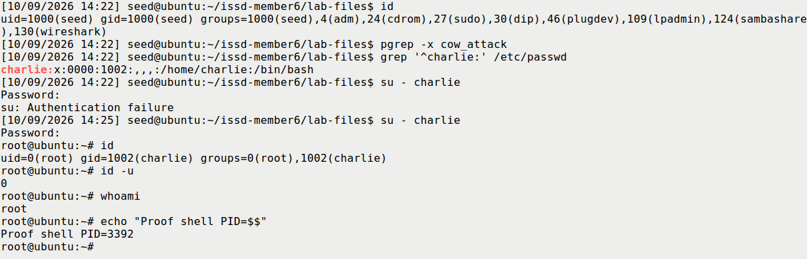

This establishes both protected-file modification and actual privileged authentication. The file diff, a shell prompt or a successful memory write alone would not establish the latter.

### 6.4 Exact restoration and new ordinary login

Proof shell 3392 was exited. A subsequent `ps` found it absent, `pgrep su` found no remaining login process, and the caller was seed. The protected baseline was compared to the pre-attack file, the current target to the saved attack result, and the original was restored administratively:

```bash
sudo cp -a /root/issd-member6-passwd.normal /etc/passwd
sudo cmp /etc/passwd /root/issd-member6-passwd.normal
sha256sum -c ../provenance/passwd-normal.sha256
su - charlie
```

**EXPECTED:** exact normal file restored and a new login uses the original nonzero UID. **ACTUAL:** the full-file comparison and hash passed; metadata returned `0:0:644:2040`; the fresh non-sudo login returned **UID 1001 / GID 1002**, `id -u` 1001 and `whoami` charlie. It then exited to seed. The exported complete restored file also matched the original pre-attack copy.

**EXPLANATION:** restoring the account database affects subsequent lookups/logins. It does not revoke credentials of already-running privileged processes, which is why exiting and checking the old UID-0 shell came first.

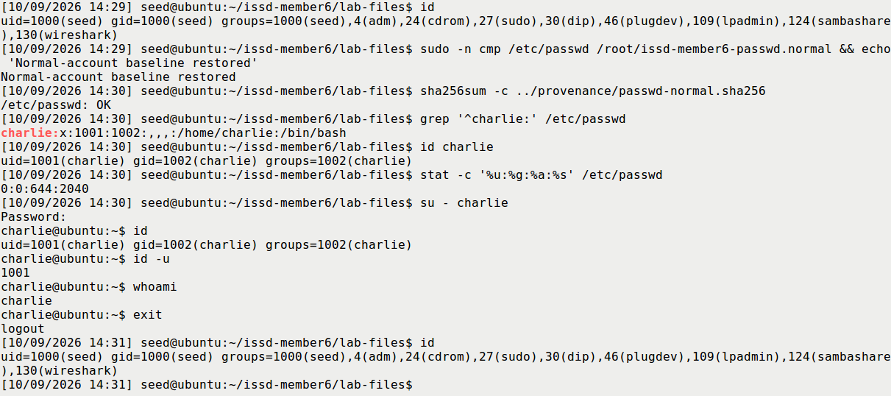

## 7. Countermeasures

| Required theme | How it addresses this threat | Practical limitation |
|---|---|---|
| Kernel patching | Corrects the vulnerable kernel COW/write-protection handling | Confirm the distribution-supported fixed kernel is actually booted; an installed package alone is insufficient |
| System updates | Maintain vendor fixes and move obsolete production systems to supported releases | Track the actual kernel package family and backports; the isolated teaching snapshot intentionally preserves historical behaviour |
| Limit local access | Reduce unnecessary shell accounts and opportunities to run untrusted local code | Reduces exposure but does not repair the kernel; another compromise may supply a local foothold |
| Monitor privilege escalation | Compare trusted account-file baselines, enumerate numeric UID-0 records and investigate privileged sessions | Detection is not prevention; memory-path changes may evade ordinary write/timestamp assumptions |

This run actually examined account hashes, full-file differences, metadata, numeric UID-0 enumeration and process identities. Before/after/restored enumeration was respectively **root only → root and charlie → root only**. Numeric comparison detects zero-padded `0000`. Authentication-log tailing is a discussion example, not an operation claimed to have been performed in this fresh run.

File permissions were already restrictive. Removing an unrelated Set-UID bit or enabling Member 5's symlink protection cannot repair this COW bug. The primary preventive fix is correct kernel handling; access restriction and integrity monitoring are complementary measures [8].

### Optional patched-VM comparison

**Not performed; discussion only. S12 was not collected.** A correctly patched kernel should preserve backing-file isolation under this race. A valid empirical comparison would need a separate fixed environment, confirmed running package, successful build/setup and bounded dummy trial. A compile error, missing target or failed memory-interface open would not be evidence of corrected COW behaviour. Even a clean bounded run without change is a finite observation rather than universal proof.

## 8. Consolidated findings and limitations

| Experiment | EXPECTED | ACTUAL | EXPLANATION / evidence |
|---|---|---|---|
| Ordinary dummy write | Denied | Permission denied; exit 1; original unchanged | Normal target permissions work, S04 |
| Normal COW control | Private change only | Private stars; backing file/hash unchanged | Correct private-copy semantics, S05 |
| Task 1 race | Exact protected-file replacement possible | Exact success; 0 integer seconds | Full fresh read/bytes/metadata, S06–S07 |
| Task 2 file overwrite | Same-width UID-only replacement | 1001 → 0000; other bytes identical | Exact 2040-byte comparison, S09 |
| Fresh account login | UID 0 if authentication succeeds | First failed; retry UID 0 | Separate privilege proof, S10 |
| Restoration | Full normal file and ordinary new login | Exact restore; fresh UID 1001 | Database and process credentials both checked, S11 |
| Patched comparison | Backing file remains protected | Not performed | Discussion only |
| Cleanup | Normal account, no lab processes/dummy | Checker exit 0; exported evidence retained | S13 and final export verification |

Only one attack trial per task was performed. Repeated worker calls were not counted, no high-resolution runtime was measured, and the recording/monitoring activity can affect scheduling. Native before/after copy timestamps are not substituted for a measured kernel race duration. The findings demonstrate this specific historical guest; they do not imply that every Ubuntu 12.04 installation or current Linux kernel is vulnerable.

The first transcript lacked a completion footer. An initial footer-based assertion failed; closure was instead verified by absence of its recorder/shell processes and matching native/copied/archive hashes. No completion marker was inserted. The raw transcript, failure qualification and verification record are retained.

Selected screenshots are genuine host captures or unedited VirtualBox framebuffers. Report/slide crops are explicitly identified readability excerpts with source/rectangle/hash provenance. S06 and S09 show completed trials. Native Task 2 recordings are preserved; the classroom fallback identifies separate excerpts and omitted authentication waiting time. These are recorded findings, not predetermined future classroom output.

## 9. Cleanup and conclusion

The UID-0 and ordinary charlie test shells were exited. The complete normal account file, charlie record and original UID-0 list were restored and checked. After confirming the dummy was the known original lab target and no attacker remained, `/zzz` was removed. The cleanup checker returned 0: no attack/wrapper/control/su/privileged shell, only `root:0`, absent dummy, matching original sources and seed-owned 0755 executables.

Charlie remains an ordinary lab account for reproducibility; its protected post-creation baseline and both snapshots are retained. The input share was explicitly unmounted. The final output-share unmount required renewed sudo authentication and did not succeed; after the archive was verified on the host, normal guest shutdown closed remaining mounts. VirtualBox then confirmed **poweroff** with the network cable disconnected.

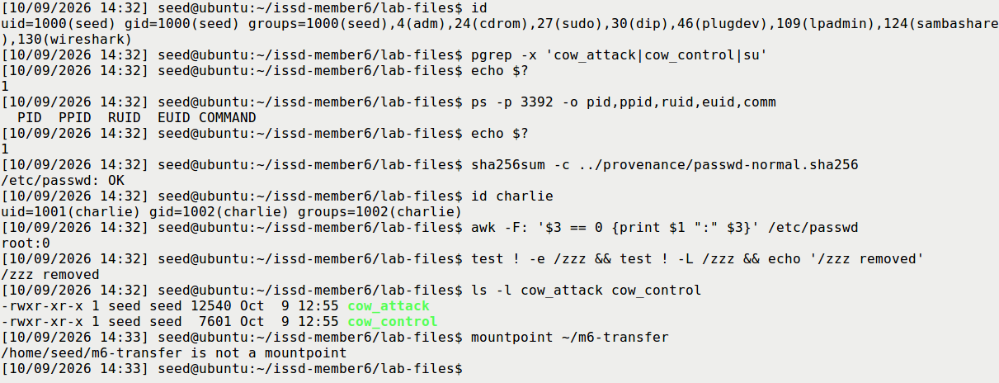

Both official tasks are supported by a complete evidence chain: ordinary write denial, correct normal COW, exact race-induced backing-file changes, a fresh non-sudo UID-0 login and verified restoration. The central lesson is that **private memory changes must remain private**. A kernel write-protection failure can undermine the account database trusted by authentication without cracking the user's password. Kernel patching is therefore the primary defence.

## 10. References and attribution

1. Wenliang Du / SEED Labs, Dirty COW Attack Lab, official page: https://seedsecuritylabs.org/Labs_20.04/Software/Dirty_COW/
2. Official task PDF and original setup: https://seedsecuritylabs.org/Labs_20.04/Files/Dirty_COW/Dirty_COW.pdf and https://seedsecuritylabs.org/Labs_20.04/Files/Dirty_COW/Labsetup.zip . Retained local copies are under `Member6/reference/`.
3. SEED VM download page and historical manual: https://seedsecuritylabs.org/labsetup.html and https://seedsecuritylabs.org/Labs_12.04/Ubuntu12_04_VM_Manual.pdf
4. Supplied lecturer text and ISSD presentation division PDF, Member 6 allocation, preserved in `Member5/course-materials/`.
5. Linux manual page, mmap(2): https://man7.org/linux/man-pages/man2/mmap.2.html
6. Linux manual page, madvise(2): https://man7.org/linux/man-pages/man2/madvise.2.html
7. Linux manual page, proc_pid_mem(5): https://man7.org/linux/man-pages/man5/proc_pid_mem.5.html
8. Ubuntu CVE-2016-5195 advisory: https://ubuntu.com/security/CVE-2016-5195 . The preparation audit retained the official tracker fallback after an advisory-page HTTP 504: https://git.launchpad.net/ubuntu-cve-tracker/plain/retired/CVE-2016-5195
9. Original SEED exploit source: https://github.com/seed-labs/seed-labs/blob/master/category-software/Dirty_COW/Labsetup/cow_attack.c
10. Repository Member 6 guide/adaptation, fresh run logs, full before/after copies, capture sidecars and live/offline verification records accompanying this report.

The repository's source research was checked during preparation on 29 September and 7 October 2026. The fresh session re-read the supplied task/source material and collected the reported experiment evidence on 9 October 2026; no new live advisory lookup is claimed here.

**Attribution:** the SEED task and exploit pattern are **Copyright 2017 Wenliang Du / SEED Labs**, licensed **Creative Commons Attribution-NonCommercial-ShareAlike 4.0 International**. The repository adaptation retains that attribution. The historical VM manual has its separate GNU Free Documentation License notice.

**Assistance disclosure:** GPT-6 Astra through OpenCode assisted with visible guest command delivery, source/evidence checks, genuine framebuffer/recording capture, export verification and document preparation. The user supplied the host settings captures and performed interactive authentication. The supplied four lab files were not rewritten during the fresh experiments. The folder name containing “opus” does not establish use of that model. No spoken rehearsal, classroom presentation or course upload is claimed to have already occurred.

## Appendix — deliverables and provenance

`README.md` identifies the report, editable slides, speaker notes, live preparation/command guides and recorded Task 2 fallback. The user approved the generic **Member 6 — ISSD** cover. Personal/course identity, deadline/upload requirements and speaking allowance remain unconfirmed; the suggested 5–7-minute plan is provisional.

`evidence/SELECTION.json` maps 21 selected originals to their fresh sources and hashes. `figures/CROP_MANIFEST.json` records each readability crop. `source/` contains the four unchanged lab files and hash manifest; `automation/` contains the verification helpers used in the VM. `logs/` retains both full transcripts, all task/control/restoration artifacts and the authentication failure. `provenance/` retains the exact-file/export and snapshot/recording verification.

The complete fresh originals remain in `Member6/evidence/incoming/opus-fresh-20261008/`. The final 46-file guest export is `member6-fresh-final-20261009.tar.gz`, SHA-256:

```text
08fe8d346f51f506a6b205683ead027d031a7d9fca34839045af7595bbb35fa1
```

The host compared its original sources, closed transcript, task artifacts, complete restored file and cleanup log. The protected root-held account backup and credential files remain in the guest. Follow `LIVE_PREPARATION.md` and `LIVE_DEMO.md` to prepare a future short dummy demonstration, state its actual outcome, and clean up afterward.
